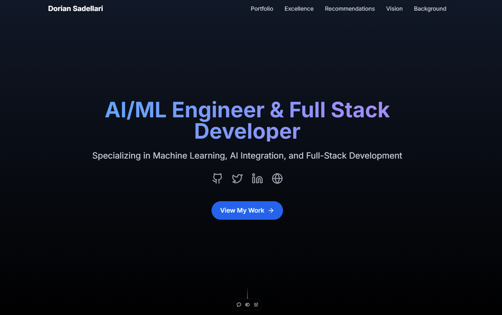

# X Web Engineer Portfolio



## 🚀 Overview

A modern, responsive portfolio site showcasing my journey as a Web Engineer, built with Next.js and Tailwind CSS. This project demonstrates my ability to ship products quickly while maintaining high quality standards.

### ✨ Features

- **Responsive Design**: Seamless experience across all devices
- **Modern Stack**: Built with Next.js 15 and Tailwind CSS
- **Smooth Animations**: Powered by Framer Motion
- **Interactive UI**: Using Radix UI components
- **Performance Optimized**: Fast loading and rendering

## 🛠 Tech Stack

- **Framework**: Next.js 15.0.2
- **UI**: Tailwind CSS, Radix UI
- **Animations**: Framer Motion
- **Icons**: Lucide React
- **Deployment**: Vercel

## 🚀 Live Demo

Visit the live site: [X Web Engineer Portfolio](https://x-portfolio-phi.vercel.app/))

## 📂 Project Structure

```
src/
├── app/
│   ├── globals.css
│   ├── layout.tsx
│   └── page.tsx
├── components/
│   ├── sections/
│   │   ├── hero.tsx
│   │   ├── portfolio.tsx
│   │   ├── evidence.tsx
│   │   ├── vision.tsx
│   │   └── background.tsx
│   └── ui/
└── lib/
    └── utils.ts
```

## 🏃‍♂️ Running Locally

1. Clone the repository:
   ```bash
   git clone https://github.com/[your-username]/x-portfolio.git
   ```

2. Install dependencies:
   ```bash
   cd x-portfolio
   npm install --legacy-peer-deps
   ```

3. Start the development server:
   ```bash
   npm run dev
   ```

4. Open [http://localhost:3000](http://localhost:3000) in your browser

## 📱 Deployment

This project is deployed on Vercel with continuous deployment enabled. Any push to the main branch will trigger a new deployment automatically.

## 📄 License

This project is licensed under the MIT License. See the [LICENSE](LICENSE) file for details.

---

Built by Dorian
